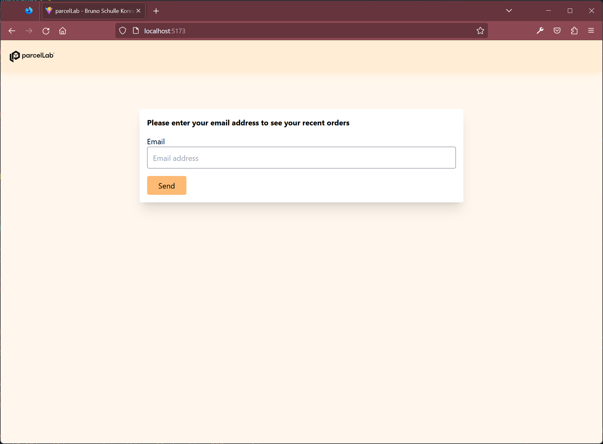
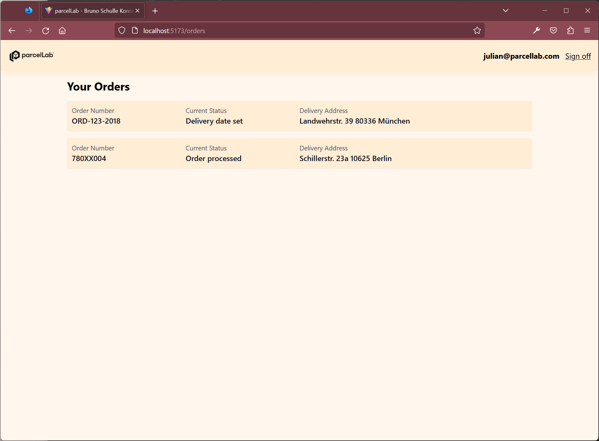
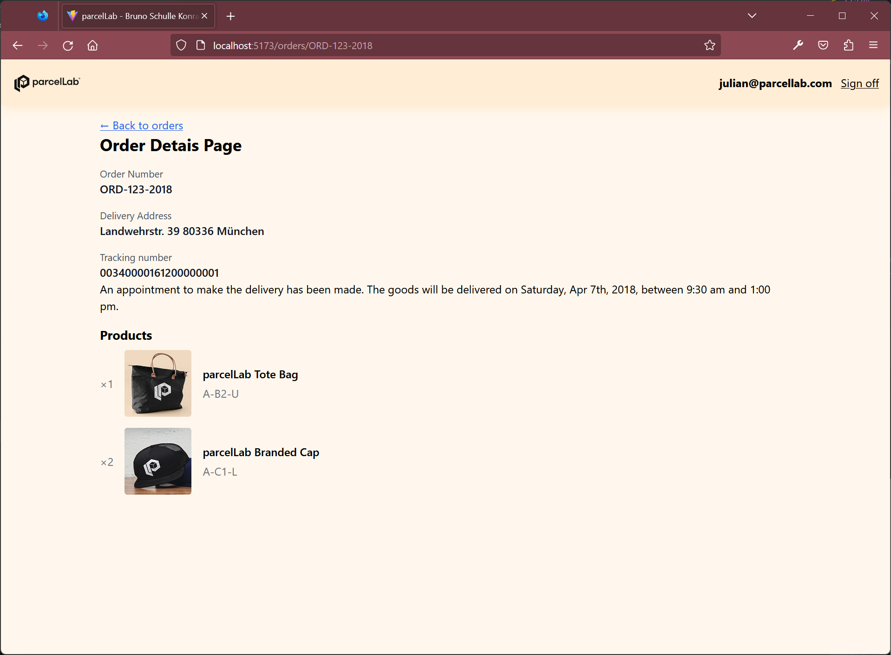

# README

Hey parcelLab folks! I'm looking forward meeting up with you and discussing this implementation.

For the backend, I decided to go with Express and a simplfied architecture, since I was getting used to MongoDB and Node as a whole. I have some ideas on how to change it, and even frameworks I'll try next.

I also decided to keep the client side simple: React, TypeScript and Tailwind. React Router for routing and data fetching.

## Setup

### Server

Inside server, we need to run `docker compose` to setup the MongoDB instance and `npm run dev` to start the backend server at port 3020.

```sh
cd server

npm start:mongo
npm run dev
```

For the first run, you will need to setup the seeds. The MongoDB instance and the application server should be running. Do so by running:

```sh
npm run seed
```

### Client

On another terminal window, we need to start the client app.

```sh
cd client

npm run dev
```

Then open http://localhost:5173 on your browser.

## Screenshots

### Login screen



### Orders



### Order details


